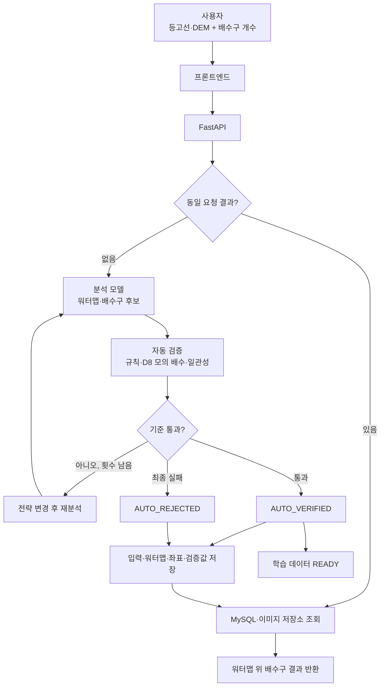
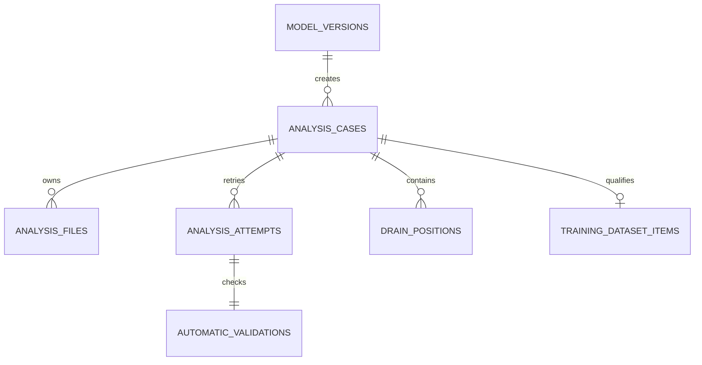

# 자동 검증 기반 백엔드 구조

## 전체 흐름

## 역할 분리

| 구성 | 역할 |
|---|---|
| `app/ai` | 현재 D8 대리 모델과 실제 AI가 지켜야 할 인터페이스 |
| `services/hydrology.py` | D8 유향·누적 유량·후보 점수 계산 |
| `services/automatic_validation.py` | 사람 없이 수행하는 독립 품질 검사 |
| `services/analysis_runner.py` | 검증 실패 시 전략 변경과 최대 시도 횟수 관리 |
| `services/image_io.py` | 업로드 검증과 DEM 전처리 |
| `services/visualization.py` | 워터맵과 워터맵 기반 배수구 표시 이미지 생성 |
| `services/storage.py` | 사례별 이미지 파일 저장 |
| `models.py` | MySQL 테이블 ORM 정의 |
| `main.py` | API, 캐시, 분석 실행, 결과·학습 데이터 저장 |

## 한 사례의 저장 관계

`analysis_cases.id`가 입력 이미지, 결과 이미지, 모든 분석 시도, 자동 검증값, 최종 배수구
좌표와 재학습 자료를 묶는 공통 식별자입니다.

## 상태 규칙

| 상태 | 의미 | 재학습 사용 |
|---|---|---|
| `AI_GENERATED` | 분석 사례 생성됨 | 불가 |
| `AUTO_VALIDATING` | 자동 검증 또는 재분석 중 | 불가 |
| `AUTO_VERIFIED` | 모든 자동 기준 통과 | `READY` 등록 |
| `AUTO_REJECTED` | 모든 시도 후에도 기준 미달 | 제외 |

AI 결과를 그대로 자기 학습 정답으로 사용하지 않습니다. 자동 검증은 별도 모듈에서
수행하고, 통과한 결과도 고신뢰도 의사 라벨로 구분합니다. 실측·시뮬레이션 정답을
확보하면 학습 데이터의 우선 기준으로 사용해야 합니다.
